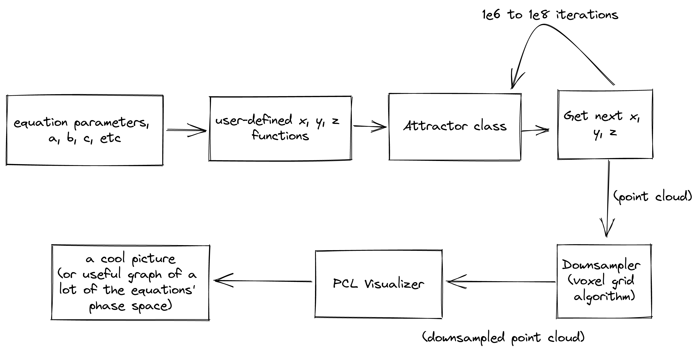
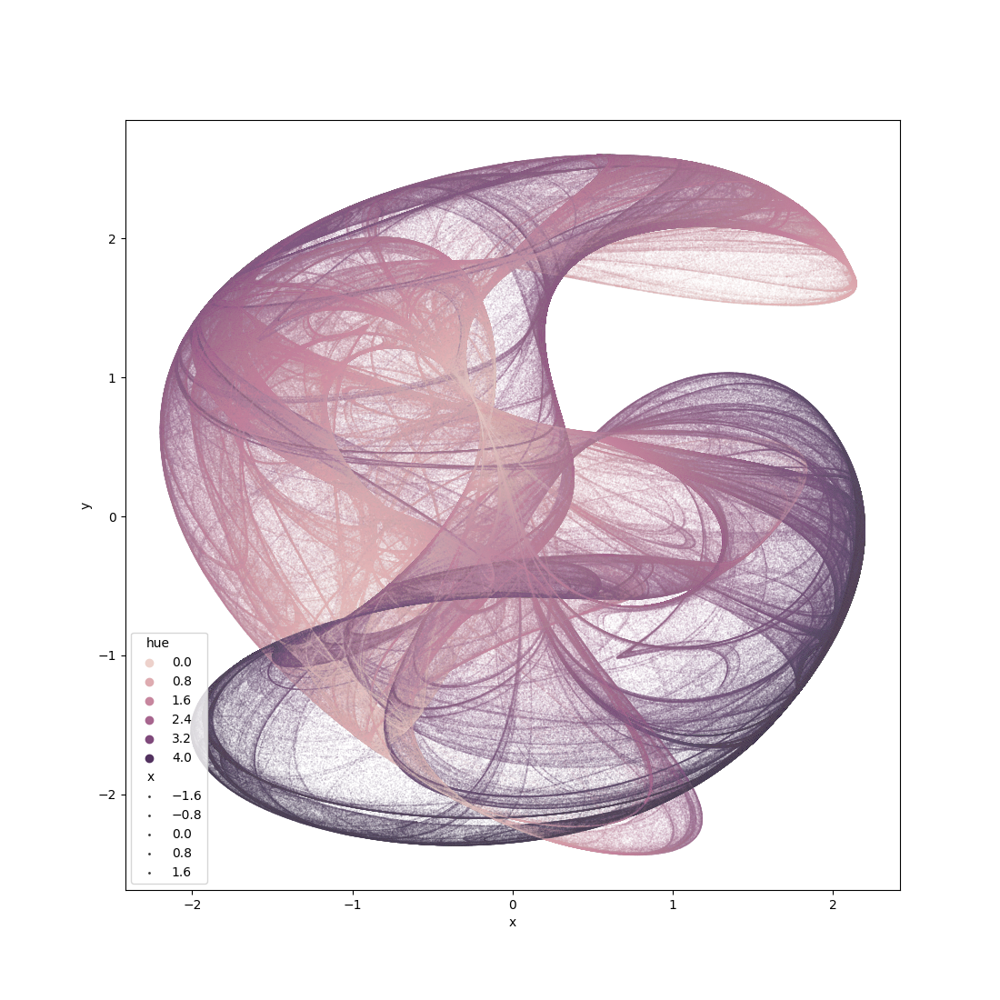
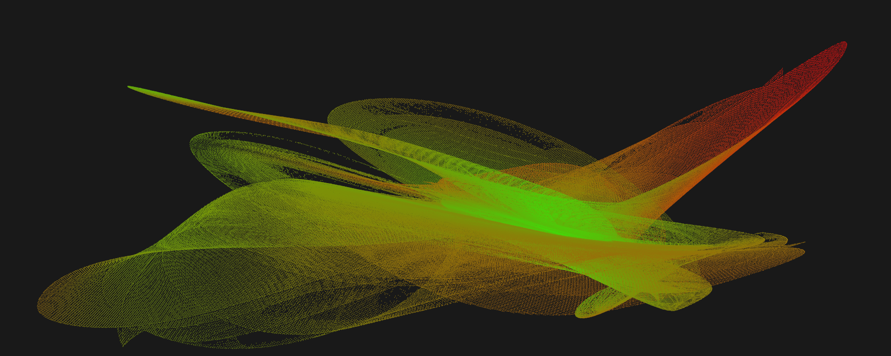
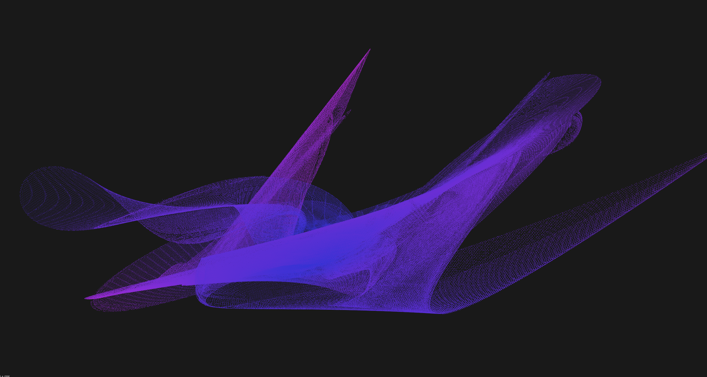

# Strange attractor visualization tool
Final project for University of Pittsburgh ECE 1895.

## Design

### 1. User-defined functions
First step is pretty important, basically the user of the Attractor class will define some functions that represent the next x, y, and z points as a function of the previous ones. Typically, those functions have some real number parameters $a$, $b$, $c$, etc., within the bound $[-1, 1]$.

### 2. Attractor class
The Attractor class is a template class that's pretty simple. It takes in any functions with the correct signature (i.e. `double(Vec4)`).

NOTE: If higher precision is needed (at the cost of computation time), compile time defines can be set to control what the underlying type used for floating point calculations is. By default, it's double. See `multiprecision.hpp` for more info on what those compile-time definitions are and what they do.

### 3. Iterating and downsampling
Next a bunch of iterations are run. For memory saving purposes, the main program breaks the iterations up into chunks. Each chunk runs ~1e8 points before memory is almost exhausted, then it's downsampled and added to another cloud outside the loop. This repeats a few times, then after the loop the final cloud is downsampled one more time for display.

### 4. Visualization
A visualizer should come up. If the equations don't converge or diverge, then you'll see a shape. Left click + drag to rotate the view, scroll to zoom in and out, and middle click + drag to pan.

## Examples

One of the first attractor visualizations made with this

A 3D quadratic attractor

Same attractor as above, but with different parameters

## Testing Results
Initially with 2D clifford attractors and before I had C++-based visualization working, I wrote Visualize.ipynb to confirm the shapes I was getting against others' independent implementations [^1]. They matched.

## Future Improvements
 - **Surface estimation** - Algorithms exist to take a point cloud and estimate a solid mesh out of it. PCL implements this, I just didn't have the time to try it out. If it works, visualization would be a lot less computationally intensive, and phase spaces could be exported as STL files for or 3D viewing applicatons
 - **Multithreading** - Some equation sets are able to be multithreaded. Clifford attractor is allegedely one of those. A set of equations can be parallelized if, for any input x, y, z, the output is within the attractor's phase space.
 - **Convergence detection** - Detect when the lead point doesn't move for some amount of time, and stop early
 - **4D attractor** - Support equation sets of 4. Sweep the w (4th) dimension as time, showing a (hopefully) evolving/shifting shape.

[^1]: http://paulbourke.net/fractals/clifford/
